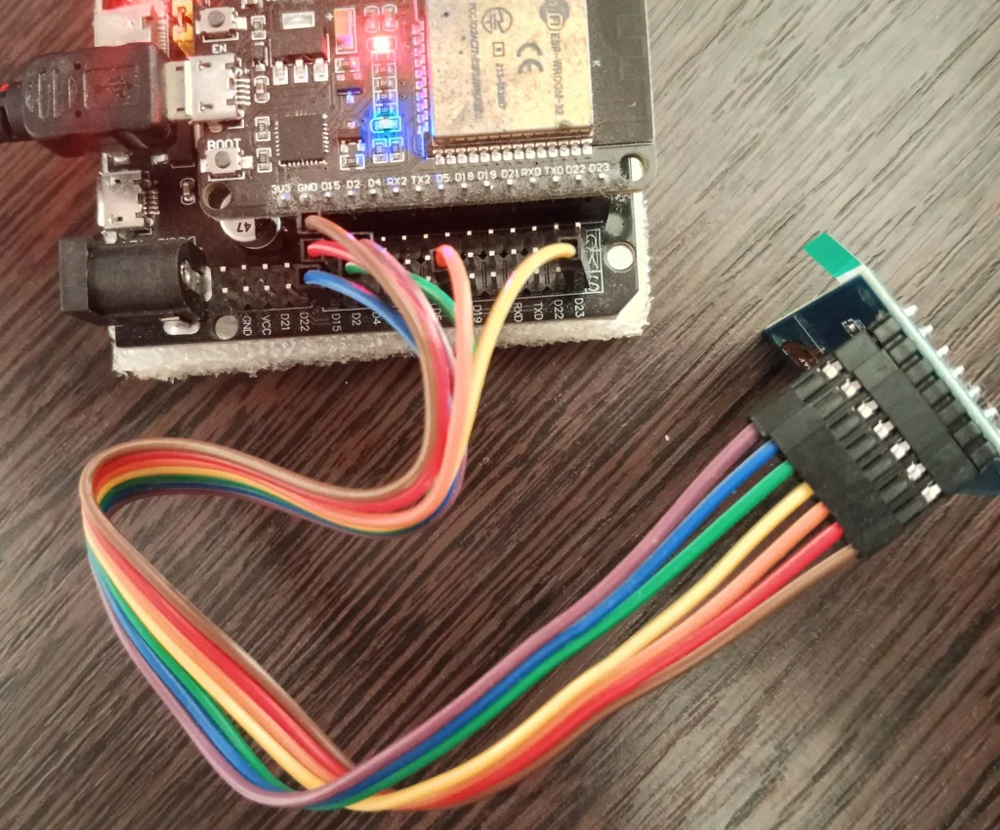

# screen — GMT130 240×240 IPS display (ST7789)

Driving the GMT130 240×240 IPS display (ST7789VW controller) from an
ESP32-WROOM-32 over SPI. The wiring was verified on the actual board: each
wire was traced from the display connector to the ESP32 headers.

## Build & flash

A PlatformIO project (Arduino framework, `TFT_eSPI`):

```bash
pio run -t upload          # build and flash
pio device monitor         # open serial monitor (115200)
```

## Firmware

`src/main.cpp` initializes the panel with `TFT_eSPI` and draws the text
«Hello / World / from ESP32» at three font sizes:

- line 0: size 5 (`font_size + 3`)
- line 1: size 5 (`font_size + 3`)
- line 2: size 4 (`font_size + 2`)

Lines are spaced by `text_y_offset = 46` pixels starting at `y = 20`. The
output is static — no animation.

## Configuration

| Parameter          | Value                            |
|--------------------|----------------------------------|
| Platform           | `espressif32`                    |
| Board              | `esp32doit-devkit-v1` (WROOM-32) |
| Framework          | Arduino                          |
| Library            | `bodmer/TFT_eSPI@^2.5.43`        |
| Display            | GMT130 240×240, ST7789VW         |
| SPI                | mode 3                           |

## Wiring

| GMT130 IPS 240×240   | Wire        | ESP32 (WROOM-32)      |
|----------------------|-------------|-----------------------|
| GND                  | brown       | GND                   |
| VCC                  | red         | 3V3 (power)           |
| SCK                  | orange      | GPIO18 (D18)          |
| SDA (MOSI)           | yellow      | GPIO23 (D23)          |
| RES (RST)            | green       | GPIO4 (D4)            |
| DC                   | blue        | GPIO15 (D15)          |
| BLK (backlight)      | purple      | VCC (power, no GPIO)  |

## Important notes

- **SPI mode 3 is required** (mode 0/2 → init succeeds in the logs, but the
  panel samples data on the wrong clock edge and shows a solid black screen).
- The panel is GMT130-V1.0, ST7789VW (ST7789) controller, 240×240, no CS pin.

## Demo


## Photos





